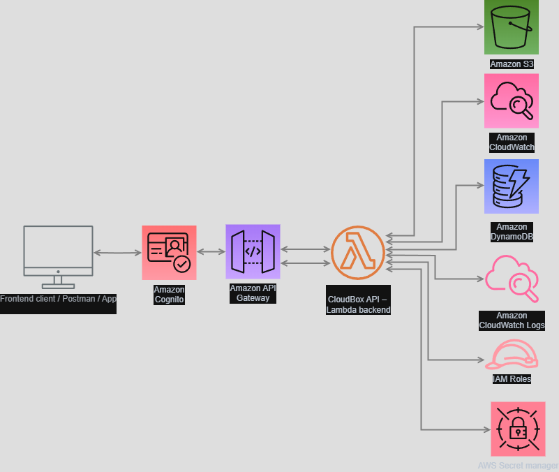

# ☁️ CloudBox – Serverless File Storage API

CloudBox is a **serverless REST API** for uploading, listing, downloading, and deleting files using AWS.  
It's a lightweight version of Google Drive, built to showcase advanced **Cloud and DevOps skills** using **Terraform**, **GitHub Actions**, **S3**, **Lambda**, **DynamoDB**, **Secrets Manager**, **CloudWatch**, and more.

> 🛠 A portfolio-grade project fully deployed via Infrastructure as Code and automated CI/CD.

---

## 🧩 Features

- 🔐 Basic authentication (API Key or JWT)
- 📤 File upload to S3
- 📄 Metadata storage in DynamoDB
- 📥 File access via **presigned URLs**
- ❌ File & metadata deletion
- 📊 Monitoring with CloudWatch + Datadog dashboard
- 🛡️ IAM role-based security + AWS Secrets Manager
- ⚙️ Full CI/CD pipeline with GitHub Actions
- 🌍 Multiple environments via Terraform workspaces (`dev` / `prod`)

---

## 📐 Architecture



---

## ⚙️ Tech Stack

| Layer            | Technologies                                                   |
|------------------|----------------------------------------------------------------|
| Infrastructure   | Terraform (modular, remote state, workspaces)                 |
| API Backend      | AWS Lambda (Node.js) + API Gateway                            |
| Storage          | Amazon S3 (file objects) + DynamoDB (metadata, GSI support)   |
| Authentication   | API Key or AWS Cognito (optional)                             |
| CI/CD            | GitHub Actions (tests, build, Terraform deploy, Lambda push)  |
| Secrets          | AWS Secrets Manager                                           |
| Monitoring       | CloudWatch Logs + Alarms + Datadog                            |
| Security         | IAM (least privilege), JSON Policies                          |

---

## 🚀 Deploying with Terraform

1. Clone the repo:
```bash
git clone https://github.com/yourusername/cloudbox.git
cd cloudbox/terraform 
```

Initialize Terraform:

``` bash
terraform init -backend-config="bucket=cloudbox-tf-state" -backend-config="key=dev/terraform.tfstate"
```

Run the plan:
``` bash
terraform plan -var-file="env/dev.tfvars"
```

Apply:

```bash
terraform apply -var-file="env/dev.tfvars"

```

⚙️ CI/CD Pipeline

On each push to main:

- Runs tests and linting
- Builds and zips the Lambda code
- Deploys via aws lambda update-function-code
- Executes terraform apply (if infra changes)

CI pipeline file: .github/workflows/deploy.yml

🔐 Security
- API protected by API Key or Cognito JWT
- Secrets (S3 keys, JWT secrets, etc.) stored in Secrets Manager
- IAM roles with least privilege policy design
- S3 bucket is private, access only via presigned URLs
- Logs and access events routed to CloudWatch

📊 Monitoring
- Logs from Lambda and API Gateway to CloudWatch
- CloudWatch alarms (errors, throttles, duration thresholds)
- CloudWatch metrics
- Optional: Cost estimation via AWS Pricing Calculator
  
📚 /docs folder
- architecture.png: architecture diagram
- screenshots/: screenshots of API Gateway, logs, dashboard
- cloudbox-demo.mp4: optional demo video recording

🔭 Roadmap
 - Upload / download / delete files
 - Secure presigned URL access
 - 100% modular Terraform infrastructure
 - CI/CD with GitHub Actions
 - Monitoring with CloudWatch
 - Cognito-based user authentication (bonus)
 - React frontend to visualize files (bonus)
 - Multi-user support via partition key (bonus)

🤝 Credits

Built with ❤️ by Virgile Fantauzzi

👉 www.linkedin.com/in/virgile-fantauzzi

📂 github.com/Kirabium/cloudbox
